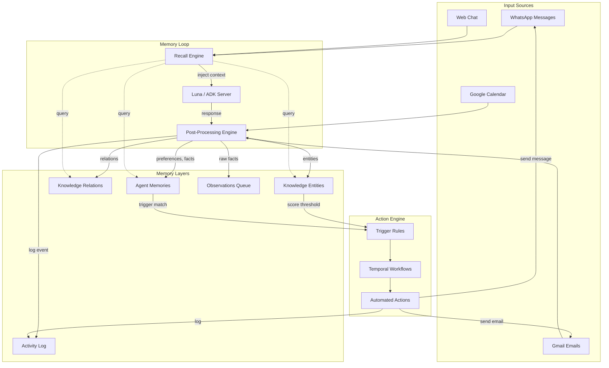
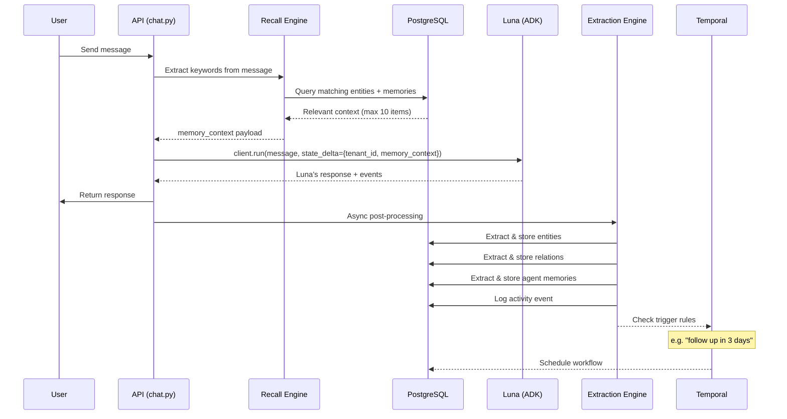
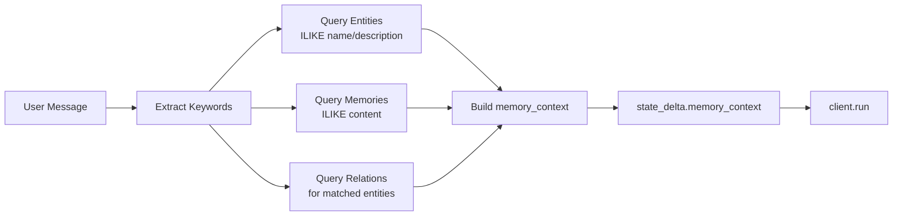
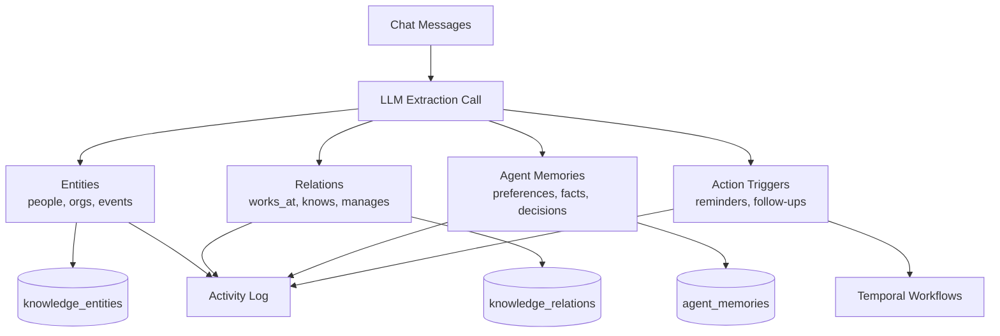
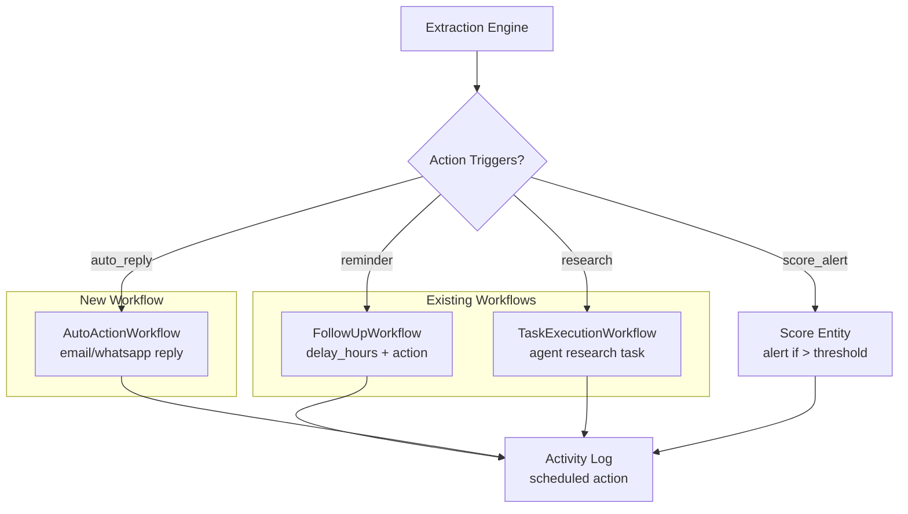
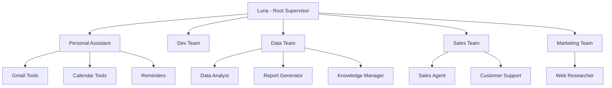
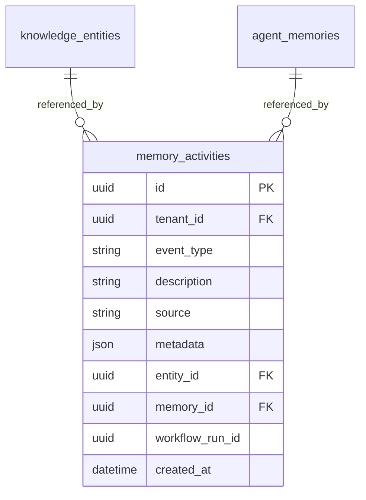
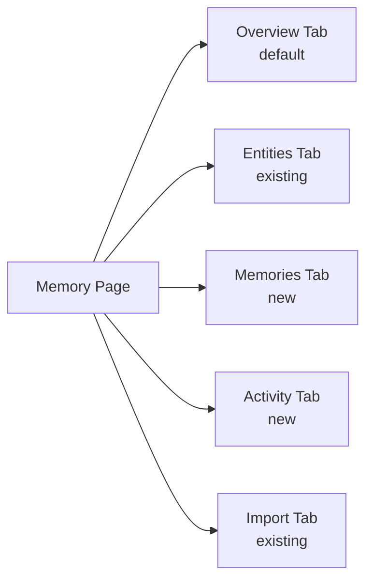

# Luna Memory System — Full Design

> **For Claude:** REQUIRED SUB-SKILL: Use superpowers:executing-plans to implement this plan task-by-task.

**Goal:** Transform Luna from a stateless chatbot into an agent with persistent memory — she learns from every interaction, recalls relevant context automatically, and triggers actions based on what she knows.

**Architecture:** Three-layer memory system (entities, relations, agent memories) with automatic recall injection, post-conversation extraction, and memory-triggered Temporal workflows. Frontend becomes Luna's control panel with 5 tabs: Overview, Entities, Memories, Activity, Import.

**Tech Stack:** FastAPI, SQLAlchemy, PostgreSQL, Temporal, React 18, Google ADK

---

## 1. Vision

Memory is Luna's brain — a control panel where users can audit her actions, knowledge, and learned behaviors. It combines automatic learning with full user control: Luna learns silently from every interaction, and the Memory page gives users a powerful dashboard to review, correct, and direct what she knows.

The Memory page is not a passive database viewer. It is Luna's **control panel** — see what she knows, what she's doing, and what she's planning to do next.

---

## 2. System Architecture

### 2.1 High-Level Data Flow



### 2.2 Per-Message Memory Loop



---

## 3. Three Memory Layers

### 3.1 Knowledge Entities (existing, working)

People, organizations, events, tasks, products, locations extracted from conversations.

**Table:** `knowledge_entities`
**Status:** Fully operational — extraction, CRUD, UI card grid all working.

### 3.2 Knowledge Relations (existing model, extraction NEW)

How entities connect: `works_at`, `knows`, `manages`, `purchased`, etc.

**Table:** `knowledge_relations` (columns: `from_entity_id`, `to_entity_id`, `relation_type`, `strength`, `evidence`)
**Status:** Model exists, API endpoints exist, UI shows in entity detail. **Missing: automatic extraction from conversations.**

### 3.3 Agent Memories (existing model, population NEW)

What Luna has learned about the user: preferences, facts, experiences, decisions.

**Table:** `agent_memories` (columns: `memory_type`, `content`, `importance`, `source`, `access_count`)
**Memory Types:** `fact`, `experience`, `skill`, `preference`, `relationship`, `procedure`
**Status:** Model + API endpoints + schemas all exist. **Never populated — no code writes to this table.**

---

## 4. Automatic Recall Injection

### 4.1 How It Works

Before each `client.run()` call in `chat.py`, query relevant context and inject into `state_delta`:



### 4.2 memory_context Structure

```json
{
  "tenant_id": "uuid",
  "memory_context": {
    "relevant_entities": [
      {"name": "John Usher", "type": "person", "category": "contact", "description": "SRE at DevRev"}
    ],
    "relevant_memories": [
      {"type": "preference", "content": "User prefers email over phone for follow-ups"}
    ],
    "relevant_relations": [
      {"from": "John Usher", "to": "DevRev", "type": "works_at"}
    ]
  }
}
```

### 4.3 Implementation Location

**File:** `apps/api/app/services/chat.py`
- New function `_build_memory_context(db, tenant_id, user_message) -> dict`
- Called before both `client.run()` calls (line ~277 and line ~337)
- Injected into `state_delta` alongside `tenant_id`
- Max 10 entities + 5 memories + 10 relations to avoid context bloat

---

## 5. Post-Conversation Extraction (Enhanced)

### 5.1 Current State

`_run_entity_extraction()` in `chat.py` calls `knowledge_extraction_service.extract_from_session()` which only extracts **entities**.

### 5.2 Enhanced Extraction



### 5.3 Enhanced LLM Prompt

The extraction prompt in `knowledge_extraction.py` will be enhanced to return:

```json
{
  "entities": [
    {"name": "John Usher", "type": "person", "category": "contact", "description": "SRE Manager", "confidence": 0.9, "attributes": {"email": "john@devrev.com"}}
  ],
  "relations": [
    {"from": "John Usher", "to": "DevRev", "type": "works_at", "confidence": 0.95, "evidence": "mentioned in email"}
  ],
  "memories": [
    {"type": "preference", "content": "User prefers morning meetings", "importance": 0.7, "source": "stated in conversation"},
    {"type": "fact", "content": "User is interviewing at Levi Strauss for SRE Manager", "importance": 0.9, "source": "conversation context"}
  ],
  "action_triggers": [
    {"type": "reminder", "description": "Follow up with DevRev in 3 days", "delay_hours": 72, "entity_name": "DevRev"}
  ]
}
```

### 5.4 Relation Persistence

New function `_persist_relations()` in `knowledge_extraction.py`:
1. For each relation, resolve `from` and `to` names to entity IDs (ILIKE match in same tenant)
2. Skip if either entity not found
3. Create `KnowledgeRelation` row with `relation_type`, `strength=confidence`, `evidence`

### 5.5 Agent Memory Persistence

New function `_persist_memories()` in `knowledge_extraction.py`:
1. Resolve a default `agent_id` for the tenant (Luna's agent row)
2. Dedup: skip if content ILIKE match exists for same agent + memory_type
3. Create `AgentMemory` row with `memory_type`, `content`, `importance`, `source`

---

## 6. Memory-Triggered Actions

### 6.1 Action Trigger Flow



### 6.2 Trigger Types

| Trigger | Source | Workflow | Example |
|---------|--------|----------|---------|
| `reminder` | Conversation: "remind me in 3 days" | `FollowUpWorkflow` (exists) | Schedule WhatsApp/email reminder |
| `follow_up` | Entity unanswered for N hours | `FollowUpWorkflow` (exists) | "DevRev hasn't responded in 48h" |
| `auto_reply` | User preference + incoming email | `AutoActionWorkflow` (NEW) | Auto-draft scheduling reply |
| `research` | New lead entity scored > threshold | `TaskExecutionWorkflow` (exists) | Agent researches company |
| `score_alert` | Entity score crosses threshold | Activity log + notification | "New high-value lead detected" |
| `daily_briefing` | Scheduled (cron) | `FollowUpWorkflow` (extend) | Morning summary via WhatsApp |

### 6.3 Luna as Root Supervisor

Luna is not a single agent — she is the **root supervisor** who orchestrates all sub-agent teams:



When memory triggers an action, it routes through Luna's ADK session so she can delegate to the right sub-agent:
- "Research competitor X" -> Luna routes to Marketing Team -> Web Researcher
- "Reply to John's email" -> Luna routes to Personal Assistant -> Gmail Tools
- "Analyze sales pipeline" -> Luna routes to Data Team -> Data Analyst
- "Follow up with lead" -> Luna routes to Sales Team -> Sales Agent

### 6.4 AutoActionWorkflow (NEW)

```python
@dataclass
class AutoActionInput:
    tenant_id: str
    action_type: str       # "reply_email", "send_whatsapp", "research", "analyze"
    entity_id: str          # Target entity
    context: str            # What to act on
    user_preferences: str   # Relevant memories for tone/style
    target_agent: str       # "personal_assistant", "sales_agent", "web_researcher", etc.

@workflow.defn(sandboxed=False)
class AutoActionWorkflow:
    """Execute automated actions by routing through Luna's sub-agent teams."""
    @workflow.run
    async def run(self, input: AutoActionInput) -> dict:
        # 1. Build action context from entity + memories
        # 2. Send to ADK as Luna (she routes to the right sub-agent)
        # 3. Log result to activity feed
        pass
```

### 6.4 Integration with Extraction

In `_run_entity_extraction()` (chat.py), after extraction completes:
1. Check `action_triggers` from LLM response
2. For each trigger, resolve entity and start appropriate Temporal workflow
3. Log trigger to activity feed

---

## 7. Activity Log

### 7.1 Data Model

New model `MemoryActivity` to track everything Luna does:



### 7.2 Event Types

| Event Type | Description | Example |
|-----------|-------------|---------|
| `entity_created` | New entity extracted | "Extracted John Usher (person) from chat" |
| `entity_updated` | Entity modified | "Updated DevRev category to customer" |
| `entity_deleted` | Entity removed | "User deleted duplicate entity" |
| `relation_created` | New relation discovered | "John Usher works_at DevRev" |
| `memory_created` | New memory learned | "Learned: user prefers email follow-ups" |
| `memory_updated` | Memory corrected | "User corrected: morning meetings preferred" |
| `action_triggered` | Workflow started | "Scheduled follow-up reminder for DevRev (72h)" |
| `action_completed` | Workflow finished | "Sent follow-up email to DevRev" |
| `action_failed` | Workflow error | "Failed to send WhatsApp: number not found" |
| `recall_used` | Memory injected into context | "Recalled 3 entities + 2 memories for context" |

---

## 8. Frontend — Luna's Control Panel

### 8.1 Tab Structure



### 8.2 Overview Tab (default landing)

```
+---------------------------------------------------------------+
|  Memory                                      [+ Add Entity]   |
|  What Luna knows, remembers, and has learned                  |
|                                                               |
|  [Overview]  [Entities]  [Memories]  [Activity]  [Import]     |
|                                                               |
|  +--------+ +--------+ +--------+ +--------+                 |
|  |   11   | |   4    | |   2    | |   5    |                 |
|  |entities | |memories| |actions | |today   |                 |
|  +--------+ +--------+ +--------+ +--------+                 |
|                                                               |
|  RECENT ACTIVITY                                              |
|  * Extracted "Simon Aguilera" from Gmail           2h ago     |
|  * Learned: user prefers email follow-ups          3h ago     |
|  * Created relation: John -> DevRev (works_at)     3h ago     |
|  * Triggered: follow-up reminder for DevRev        3h ago     |
|  * Chat entity extraction: 5 entities              5h ago     |
|                                                               |
|  MEMORY HEALTH                                                |
|  Entities:  [========--] 11     Verified: 0%                  |
|  Relations: [==--------]  2     Coverage: low                 |
|  Memories:  [==---------] 4     Freshness: today              |
|  Actions:   [===-------]  2     Pending: 1                    |
+---------------------------------------------------------------+
```

### 8.3 Entities Tab

No changes — current card grid with stats bar, filters, expand/detail, bulk actions is complete.

### 8.4 Memories Tab (NEW)

```
+---------------------------------------------------------------+
|  What Luna knows about you                                     |
|                                                               |
|  PREFERENCES                                                  |
|  +----------------------------------------------------------+|
|  | "Prefers email over phone for follow-ups"                 ||
|  | Source: Chat  |  Mar 6, 2026  |  [Edit] [Delete]         ||
|  +----------------------------------------------------------+|
|  +----------------------------------------------------------+|
|  | "Likes morning meetings"                                  ||
|  | Source: Calendar  |  Mar 5, 2026  |  [Edit] [Delete]     ||
|  +----------------------------------------------------------+|
|                                                               |
|  FACTS                                                        |
|  +----------------------------------------------------------+|
|  | "Interviewing at Levi Strauss for SRE Manager role"       ||
|  | Source: Gmail  |  Mar 4, 2026  |  [Edit] [Delete]        ||
|  +----------------------------------------------------------+|
|                                                               |
|  EXPERIENCES                                                  |
|  +----------------------------------------------------------+|
|  | "Successfully scheduled follow-up with Torc via email"    ||
|  | Source: Chat  |  Mar 6, 2026  |  [Edit] [Delete]         ||
|  +----------------------------------------------------------+|
+---------------------------------------------------------------+
```

### 8.5 Activity Tab (NEW)

```
+---------------------------------------------------------------+
|  Luna's Activity Log                                           |
|                                                               |
|  Filter: [All Sources v]  [All Types v]                       |
|                                                               |
|  TODAY                                                        |
|  14:32  [entity]  Extracted "Simon Aguilera" (person)         |
|         Source: Gmail  |  Confidence: 100%                    |
|                                                               |
|  14:32  [relation] John Usher -> DevRev (works_at)            |
|         Source: Gmail  |  Strength: 95%                       |
|                                                               |
|  14:30  [memory]  Learned: user prefers email follow-ups      |
|         Source: Chat  |  Importance: 80%                      |
|                                                               |
|  14:30  [action]  Scheduled: follow-up with DevRev in 72h     |
|         Workflow: FollowUpWorkflow  |  Status: pending        |
|                                                               |
|  11:15  [recall]  Injected 3 entities + 2 memories            |
|         Context for: "Follow up with John from DevRev"        |
|                                                               |
|  YESTERDAY                                                    |
|  ...                                                          |
+---------------------------------------------------------------+
```

---

## 9. Files Changed

### 9.1 Backend — New Files

| File | Purpose |
|------|---------|
| `apps/api/app/models/memory_activity.py` | Activity log model |
| `apps/api/app/schemas/memory_activity.py` | Activity log schemas |
| `apps/api/app/services/memory_recall.py` | Recall engine: query entities + memories by keywords |
| `apps/api/app/services/memory_activity.py` | Activity log service: create, query, stats |
| `apps/api/app/workflows/auto_action.py` | AutoActionWorkflow for memory-triggered actions |
| `apps/api/migrations/031_memory_activities.sql` | Create memory_activities table |

### 9.2 Backend — Modified Files

| File | Change |
|------|--------|
| `apps/api/app/services/chat.py` | Add `_build_memory_context()`, call before `client.run()`, enhance `_run_entity_extraction()` to handle relations + memories + triggers |
| `apps/api/app/services/knowledge_extraction.py` | Enhanced LLM prompt (relations + memories + triggers), new `_persist_relations()`, `_persist_memories()`, `_dispatch_triggers()` |
| `apps/api/app/api/v1/memories.py` | Add: `GET /memories/tenant` (all memories for tenant by type), `GET /memories/activity` (activity feed), `GET /memories/stats` (overview stats) |
| `apps/api/app/api/v1/routes.py` | Register new activity endpoints |

### 9.3 Frontend — New Files

| File | Purpose |
|------|---------|
| `apps/web/src/components/memory/OverviewTab.js` | Stats tiles + activity feed + health bar |
| `apps/web/src/components/memory/MemoriesTab.js` | Memory cards grouped by type |
| `apps/web/src/components/memory/ActivityFeed.js` | Chronological event feed component |
| `apps/web/src/components/memory/MemoryHealthBar.js` | Visual health/completeness indicator |
| `apps/web/src/components/memory/MemoryCard.js` | Individual memory card (edit/delete) |

### 9.4 Frontend — Modified Files

| File | Change |
|------|--------|
| `apps/web/src/services/memory.js` | Add: `getMemoriesByType()`, `getActivityFeed()`, `getMemoryStats()`, `updateMemory()`, `deleteMemoryItem()` |
| `apps/web/src/pages/MemoryPage.js` | Add Overview (default), Memories, Activity tabs; restructure tab navigation |
| `apps/web/src/pages/MemoryPage.css` | Styles for new tabs, activity feed, memory cards, health bars |
| `apps/web/src/components/memory/constants.js` | Add MEMORY_TYPES config, ACTIVITY_EVENT_TYPES, MEMORY_SOURCES |

---

## 10. Implementation Order

### Phase 1: Backend Memory Engine
1. Create `memory_activities` model + migration
2. Create `memory_activity.py` service (CRUD + query)
3. Enhance `knowledge_extraction.py` — add relation + memory extraction to LLM prompt
4. Add `_persist_relations()` to extraction service
5. Add `_persist_memories()` to extraction service
6. Add activity logging calls to extraction service
7. Create `memory_recall.py` — keyword-based entity + memory query
8. Wire recall into `chat.py` — inject `memory_context` into `state_delta`

### Phase 2: API Endpoints
9. Add tenant-scoped memory list endpoint (`GET /memories/tenant`)
10. Add activity feed endpoint (`GET /memories/activity`)
11. Add memory stats endpoint (`GET /memories/stats`)

### Phase 3: Action Engine
12. Add `_dispatch_triggers()` to extraction service — parse action_triggers from LLM
13. Create `AutoActionWorkflow` Temporal workflow
14. Wire trigger dispatch into `_run_entity_extraction()` flow

### Phase 4: Frontend
15. Update `constants.js` — memory types, activity event types
16. Update `memory.js` service layer — new API calls
17. Build `MemoryHealthBar.js` component
18. Build `OverviewTab.js` — stats tiles + recent activity + health bar
19. Build `MemoryCard.js` — individual memory with edit/delete
20. Build `MemoriesTab.js` — cards grouped by type
21. Build `ActivityFeed.js` — chronological event feed
22. Rewire `MemoryPage.js` — 5 tabs with Overview as default

### Phase 5: Integration
23. End-to-end test: chat message -> extraction -> recall -> display
24. Test action triggers: reminder from conversation -> Temporal workflow -> activity log

---

## 11. Verification Checklist

1. Send a chat message mentioning a person and company -> verify entity + relation extracted
2. Express a preference in chat ("I prefer email") -> verify agent memory created
3. Send another message about that person -> verify Luna's response includes recalled context
4. Say "remind me to follow up in 3 days" -> verify FollowUpWorkflow triggered
5. Open Memory page -> Overview tab shows stats, recent activity, health bar
6. Click Entities tab -> existing card grid works with new relation data
7. Click Memories tab -> see grouped memory cards, edit/delete works
8. Click Activity tab -> chronological feed with source filters
9. Delete a memory -> verify activity log shows deletion event
10. Check Activity tab -> verify all actions (extract, recall, trigger) are logged
