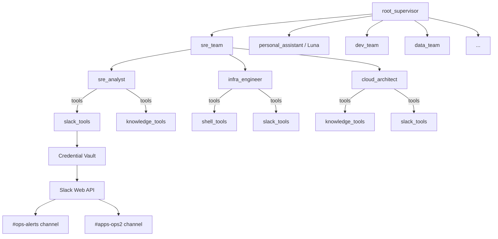

# SRE Agent Team Design

> **Status:** On hold — pending memory layer testing
> **Date:** 2026-03-06
> **Goal:** Give Luna SRE/DevOps/Cloud superpowers through a new sub-agent team with Slack integration and Integral FX domain knowledge.

## Context

The user is an SRE/AI professional managing two infrastructure worlds:

1. **Cloud-native** (GKE, Helm, Terraform, GitHub Actions) — where Luna lives
2. **On-premise FX trading** (800+ servers, 5 DCs, Nagios/Prometheus/Grafana, HAProxy, JBoss, Oracle) — Integral FX

An existing **Infra Control Plane Center** (`infra-control-plane-center`) provides 51 MCP tools for Integral infrastructure monitoring, but is only accessible via VPN. Luna cannot call it directly from GKE.

**Strategy:** Build Luna's SRE capabilities using Slack as the bridge to Integral ops context. Duplicate the Slack integration pattern from the control plane into Luna's ADK. Defer direct control plane API integration until network access is resolved.

## Architecture



## 1. Slack Integration (OAuth + Tools)

### OAuth Provider

Reuse the existing Slack app from the Integral control plane project. Add Slack as a fourth OAuth provider alongside Google, GitHub, LinkedIn.

**API config additions** (`apps/api/app/core/config.py`):
```python
SLACK_CLIENT_ID: str = ""
SLACK_CLIENT_SECRET: str = ""
SLACK_REDIRECT_URI: str = ""
```

**OAuth provider entry** (`apps/api/app/api/v1/oauth.py`):
```python
"slack": {
    "authorize_url": "https://slack.com/oauth/v2/authorize",
    "token_url": "https://slack.com/api/oauth.v2.access",
    "userinfo_url": "https://slack.com/api/auth.test",
    "scopes": [
        "channels:history", "channels:read",
        "chat:write", "groups:history", "groups:read",
        "search:read", "reactions:write",
        "users:read", "im:history",
    ],
    "skill_names": ["slack"],
}
```

**Key difference from Google:** Slack bot tokens (`xoxb-`) don't expire, so no refresh logic needed in the internal token endpoint.

### Slack Tools

**New file:** `apps/adk-server/tools/slack_tools.py`

Follows the `google_tools.py` pattern: retrieve token from credential vault via `/oauth/internal/token/slack`, call Slack Web API with `httpx`.

| Tool | Slack API Method | Purpose |
|------|-----------------|---------|
| `search_slack_messages` | `search.messages` | Search messages across channels by query |
| `read_slack_channel` | `conversations.history` | Read recent messages from a specific channel |
| `get_slack_thread` | `conversations.replies` | Read a full thread/conversation |
| `send_slack_message` | `chat.postMessage` | Post message to channel or thread |
| `list_slack_channels` | `conversations.list` | List channels Luna can access |
| `react_to_message` | `reactions.add` | Acknowledge alerts with emoji reactions |

**Tool signature pattern:**
```python
async def search_slack_messages(
    tenant_id: str = "auto",
    query: str = "",
    channel_id: str = "",
    max_results: int = 20,
) -> dict:
    """Search Slack messages across channels.

    Args:
        tenant_id: Tenant context. Use "auto" if unknown.
        query: Search query (supports Slack search modifiers like
               "from:@user", "in:#channel", "has:link", "before:2026-03-01").
        channel_id: Optional - limit search to specific channel.
        max_results: Maximum messages to return (1-100).

    Returns:
        Dict with matching messages (text, user, channel, timestamp, permalink).
    """
```

### Frontend

Add "Slack" card to Integrations page, same style as Google/GitHub/LinkedIn. Shows connected workspace name after OAuth.

## 2. SRE Team Structure

### sre_team (Routing Supervisor)

**File:** `apps/adk-server/servicetsunami_supervisor/sre_team.py`

Routes SRE requests to the appropriate specialist. No tools — routing only.

```
Routing rules:
- Alert triage, ops channel monitoring, incident analysis -> sre_analyst
- kubectl, deployments, scaling, CI/CD, cloud troubleshooting -> infra_engineer
- Architecture design, capacity planning, cost optimization -> cloud_architect
```

### sre_analyst (Leaf Agent)

**File:** `apps/adk-server/servicetsunami_supervisor/sre_analyst.py`

**Tools:** `search_slack_messages`, `read_slack_channel`, `get_slack_thread`, `react_to_message`, `search_knowledge`, `find_entities`, `create_entity`

**Role:** The "eyes on the dashboards" agent.
- Reads ops Slack channels for alerts and incidents
- Detects patterns across messages (recurring alerts, correlated failures)
- Triages severity based on trading hours and affected services
- Stores learned patterns as knowledge entities for future reference
- Knows Integral hostname conventions, DC topology, service dependencies

**Personality:** Calm, methodical. Thinks like a senior SRE. Correlates before escalating.

### infra_engineer (Leaf Agent)

**File:** `apps/adk-server/servicetsunami_supervisor/infra_engineer.py`

**Tools:** `execute_shell`, `search_slack_messages`, `read_slack_channel`, `search_knowledge`

**Role:** Hands-on cloud-native troubleshooting.
- `kubectl` commands against GKE clusters (get pods, describe, logs, scale)
- `helm` status, history, rollback
- `gcloud` commands for GCP resources
- `gh` CLI for GitHub Actions workflow status, PR checks
- Can leverage dev_team pipeline to create new tools when needed

**Personality:** Pragmatic, action-oriented. Fix first, document after.

### cloud_architect (Leaf Agent)

**File:** `apps/adk-server/servicetsunami_supervisor/cloud_architect.py`

**Tools:** `search_knowledge`, `find_entities`, `create_entity`, `search_slack_messages`

**Role:** Strategic advisory.
- Analyzes patterns from sre_analyst findings
- Proposes architecture improvements and optimizations
- Capacity planning based on metric trends
- Cost optimization recommendations
- Stores architectural decisions and recommendations in knowledge graph

**Personality:** Big-picture thinker. Proactive — suggests improvements the user hasn't considered.

## 3. SRE Domain Knowledge

### Static Knowledge (Agent Instructions)

Baked into `sre_analyst` instruction string:

**Hostname decoding:**
| Prefix | Location | Example |
|--------|----------|---------|
| `pp` | London Primary | ppfxidb1 |
| `np` | New York | npfxiapp3 |
| `sp` | Singapore | spfxiclob2 |
| `tp` | Tokyo | tpfxidb1 |
| `lp` | London LD4 | lpfxianldb1 |
| `dm` | Demo | dmfxiadp1 |

**System suffixes:** `fxi`=FX Integral, `adp`=Adapter, `db`=Database, `app`=Application, `gw`=Gateway, `clob`=Matching Engine, `mth`=Math

**Trading hours (GMT):**
- Tokyo: 00:00-09:00
- Singapore: 01:00-10:00
- London: 08:00-17:00
- NYC: 13:00-22:00

**Service dependency chain:**
1. SonicMQ (messaging) — must be up first
2. Grid Manager — orchestrates trading grid
3. CLOB + JBoss + MDF (core processing)
4. Adapters (external connectivity) — started last

**Datacenter topology:**
| DC | Publisher Server | Region |
|----|-----------------|--------|
| NY | ppoggvm001 | pp*, np* |
| London | lpoggvm001 | lp* |
| Tokyo | tpoggvm001 | tp* |
| Singapore | sggw001 | sg*, sp* |
| UAT | cuoggvm001 | mv*, cu* |

### Dynamic Knowledge (Learned from Slack)

Built over time as Luna reads ops channels:
- Alert patterns and recurring incidents
- Resolution playbooks (what fixed what)
- Correlation rules (alert X in NY usually means Y in London)
- Service-specific quirks and known issues
- Escalation contacts and on-call rotation

Stored via the memory extraction system (entities + relations + memories).

## 4. Root Supervisor Update

Add `sre_team` to the root supervisor's sub_agents list and routing instructions:

```
## Routing addition:
- Infrastructure alerts, SRE operations, server health, Slack ops,
  cloud troubleshooting, architecture design -> transfer to sre_team
```

## 5. Future: Control Plane Integration

When VPN/network access is resolved, add tools that call the Infra Control Plane API directly:

```python
# Future: tools/control_plane_tools.py
CONTROL_PLANE_URL = "http://control-plane.integral.com:8080"

async def query_prometheus(query: str, region: str, ...) -> dict:
    resp = await client.post(f"{CONTROL_PLANE_URL}/api/tools/query-prometheus", ...)

async def check_server_health(hostname: str, ...) -> dict:
    resp = await client.post(f"{CONTROL_PLANE_URL}/api/tools/check-server-health", ...)

async def analyze_alerts(region: str, days: int, ...) -> dict:
    resp = await client.post(f"{CONTROL_PLANE_URL}/api/tools/analyze-alerts", ...)
```

This bridges all 51 MCP tools without duplication. The sre_analyst and infra_engineer tools lists expand to include these.

## Implementation Order

1. Slack OAuth provider (API config + oauth.py + frontend card)
2. Slack tools (`tools/slack_tools.py`)
3. SRE team agents (supervisor + 3 leaf agents)
4. Root supervisor update (add sre_team routing)
5. SRE knowledge seeding (entities for server inventory, trading hours)
6. Testing: Connect Slack, verify channel reads, test agent routing

## Dependencies

- Memory layer enhancements must be tested first
- Slack app credentials from control plane `.env`
- Slack app must have the required OAuth scopes listed above
