# Reinforcement Learning Framework — Design Document

**Date:** 2026-03-12
**Status:** Draft
**Approach:** Reward-Weighted Experience Store (RWES)

---

## Overview

ServiceTsunami has proto-RL infrastructure scattered across the platform — skill proficiency tracking (+0.02 fixed increments), memory access counts, execution traces, lead scoring rubrics — but none of it forms a coherent learning loop. This design formalizes reinforcement learning as a first-class architectural capability, enabling the platform to learn from every decision it makes and improve over time.

### High-Level Architecture

```
 DECISION POINTS                    POLICY ENGINE                    EXPERIENCE STORE
+---------------------------+      +-------------------------+      +--------------------+
| Agent Selection           |      |                         |      |                    |
| Memory Recall             |----->| State Encoder           |      | rl_experiences     |
| Skill Routing             |      |        |                |      |        |           |
| Orchestration Routing     |      |        v                |      |        |           |
| Triage Classification     |      | Policy Lookup <---------+------+-  rl_policy_states |
| Response Generation       |      |        |                |      |        ^           |
| Tool Selection            |      |        v                |      |        |           |
| Entity Validation         |      | Score Candidates        |      |        |           |
+---------------------------+      |        |                |      |        |           |
                                   |        v                |      |        |           |
                                   | Explore/Exploit Gate ---+----->| decision +         |
                                   +-------------------------+      | explanation        |
                                                                    +--------+-----------+
                                                                             |
 REWARD PIPELINE                         LEARNING LOOP                       |
+---------------------------+      +-------------------------+               |
| Implicit Signals  (w=0.3) |      |                         |               |
| Explicit Feedback (w=0.5) |----->| Reward ----------------->---------------+
| Admin Reviews     (w=0.2) |      | Compositor              |
+---------------------------+      |                         |      +--------------------+
                                   +-------------------------+      |                    |
                                                                    |  Online Update     |
                                   rl_experiences ----------------->|  (immediate)       |----> rl_policy_states
                                                                    |                    |
                                   rl_experiences ----------------->|  Nightly Batch     |----> rl_policy_states
                                                                    |  (full recompute)  |
                                                                    +--------------------+
```

### Design Decisions

| Decision | Choice | Rationale |
|---|---|---|
| Optimization scope | Unified (agent selection, memory, response quality, orchestration) | All decision points share a common experience model |
| Reward signals | Full spectrum: implicit + explicit + structured + admin review | Richest signal for fastest, most accurate learning |
| Learning mechanism | Hybrid: online for low-risk, batch for high-impact | Temporal already supports batch; some signals are safe to act on immediately |
| Multi-tenancy | Federated: global baseline + per-tenant fine-tuning | Solves cold-start without leaking tenant data |
| Explainability | Full transparency: users see why decisions were made | Enterprise requirement; RWES is inherently explainable via similar-experience references |
| Exploration | Balanced with guardrails: configurable rate, quality floor, tenant opt-out | Enterprise customers need stability guarantees |
| UI placement | Dedicated "Learning" page under AI OPERATIONS in sidebar | RL is a first-class capability deserving its own navigation entry |
| Internationalization | Spanish + English via i18next | Consistent with platform's existing i18n support |

---

## 1. Core Data Model — The Experience Store

The heart of the system is a single `rl_experiences` table that captures every decision the platform makes, along with its outcome.

### Entity Relationship Diagram

```
+-------------------+          +------------------------+          +---------------------+
|     TENANTS       |          |    RL_EXPERIENCES       |          |  RL_POLICY_STATES   |
+-------------------+          +------------------------+          +---------------------+
| id            PK  |----+     | id              PK     |     +--->| id             PK   |
| ...               |    |     | tenant_id        FK ---+--+  |    | tenant_id      FK   |--+
+-------------------+    |     | trajectory_id          |  |  |    |   (nullable=global) |  |
         |               +---->| step_index             |  |  |    | decision_point      |  |
         |                     | decision_point         |  |  |    | weights        JSON |  |
         |                     | state            JSON  |  |  |    | version             |  |
         |                     | action           JSON  |  |  |    | experience_count    |  |
         v                     | alternatives     JSON  |  |  |    | last_updated_at     |  |
+-------------------+          | reward         FLOAT?  |  |  |    | exploration_rate    |  |
|  TENANT_FEATURES  |          | reward_components JSON |  |  |    +---------------------+  |
+-------------------+          | reward_source          |  |  |                              |
| id            PK  |          | explanation      JSON  |  |  |                              |
| tenant_id     FK  |----+     | policy_version --------+--+--+                              |
| rl_enabled   BOOL |    |     | exploration      BOOL  |  |                                 |
| rl_settings  JSON |    |     | created_at             |  |                                 |
+-------------------+    |     | rewarded_at       DT?  |  |                                 |
                         |     | archived_at       DT?  |  |                                 |
                         |     +------------------------+  |                                 |
                         |                                 |                                 |
                         +---------------------------------+---------------------------------+
                                    all linked by tenant_id
```

### `rl_experiences` Table

| Column | Type | Description |
|---|---|---|
| `id` | UUID | Primary key |
| `tenant_id` | UUID (FK → tenants) | Tenant isolation |
| `trajectory_id` | UUID | Links steps in multi-step tasks |
| `step_index` | Integer | Position within trajectory |
| `decision_point` | String | One of: `agent_selection`, `memory_recall`, `skill_routing`, `orchestration_routing`, `triage_classification`, `response_generation`, `tool_selection`, `entity_validation`, `score_weighting`, `sync_strategy`, `execution_decision`, `code_strategy`, `deal_stage_advance`, `change_significance` |
| `state` | JSON | Context features at decision time (normalized feature vector) |
| `action` | JSON | What was chosen (agent_id, memory_ids, skill_name, etc.) |
| `alternatives` | JSON | What else could have been chosen + their scores |
| `reward` | Float (nullable) | Computed reward (-1.0 to 1.0), null until feedback arrives |
| `reward_components` | JSON | Breakdown: `{implicit: 0.3, explicit: 0.8, ...}` |
| `reward_source` | String | `implicit`, `explicit_rating`, `structured_feedback`, `admin_review` |
| `explanation` | JSON | Why this action was chosen (for user-facing transparency) |
| `policy_version` | String | Which policy version made this decision |
| `exploration` | Boolean | Was this an exploration action? |
| `created_at` | DateTime | When the decision was made |
| `rewarded_at` | DateTime (nullable) | When reward was assigned |
| `archived_at` | DateTime (nullable) | When experience was archived (soft-delete for retention policy) |

### `rl_policy_states` Table

| Column | Type | Description |
|---|---|---|
| `id` | UUID | Primary key |
| `tenant_id` | UUID (FK, nullable) | NULL = global baseline |
| `decision_point` | String | Which decision this policy governs |
| `weights` | JSON | Current policy weights/parameters |
| `version` | String | Monotonically increasing |
| `experience_count` | Integer | How many experiences trained on |
| `last_updated_at` | DateTime | Last policy update |
| `exploration_rate` | Float | Current epsilon for this tenant+decision |

### Key Design Choices

- **`trajectory_id`** links all decisions in a single task execution, enabling cross-step credit assignment.
- **`alternatives`** stores what was _not_ chosen — essential for counterfactual learning and explainability.
- **`reward` is nullable** — experiences are stored immediately at decision time, rewards arrive later (sometimes much later for batch review).
- **`explanation`** is populated at decision time so users can see "why" even before outcomes are known.
- **State is a JSON feature vector**, not raw data — the state encoder normalizes context into comparable features.

### Data Management & Performance

**Retention Policy:**
- Active window: 90 days of full experiences retained in `rl_experiences`
- After 90 days: experiences are aggregated into policy weights during nightly batch, then archived (soft-deleted with `archived_at` timestamp)
- Archive cleanup: hard-delete archived experiences older than 1 year via nightly workflow

**Table Partitioning:**
- Partition `rl_experiences` by `tenant_id` + month (`created_at`) for efficient tenant-scoped queries and retention management
- Primary index: `(tenant_id, decision_point, created_at DESC)` — covers the most common query pattern
- Secondary index: `(trajectory_id)` — for cross-step reward propagation lookups

**Similarity Search Strategy:**
- pgvector is not available in production Cloud SQL. Full cosine similarity over all experiences is not viable at scale.
- **Approach: Recent-N with categorical pre-filtering.** For each scoring request:
  1. Filter by `tenant_id + decision_point` (index hit)
  2. Further filter by categorical state features (exact match on `task_type`, `memory_type`, etc.)
  3. Load at most the **last 200 matching experiences** (ordered by `created_at DESC`)
  4. Compute cosine similarity on numeric features in-application code over this bounded set
- This caps similarity computation at O(200) per decision, adding < 10ms latency
- As pgvector becomes available (embedding service in progress), migrate to SQL-level vector similarity for improved recall

---

## 2. Decision Point Coverage

Every decision-bearing object in the platform generates experiences:

### Workflow Decisions

| Platform Object | Decision Point | State Features | Action |
|---|---|---|---|
| `TaskExecutionWorkflow` | `agent_selection` | task type, required capabilities, historical success rates | which agent was dispatched |
| `TaskExecutionWorkflow` | `memory_recall` | agent context, message keywords, memory scores | which memories were surfaced |
| `TaskExecutionWorkflow` | `skill_routing` | task type, agent skills, proficiency scores | which skill executed |
| `AgentKitExecutionWorkflow` | `orchestration_routing` | supervisor context, sub-agent availability | which sub-agent handled it |
| `InboxMonitorWorkflow` | `triage_classification` | email content, sender history, entity context | priority assigned, notification created or skipped |
| `CompetitorMonitorWorkflow` | `change_significance` | competitor entity, observation history | alert threshold, notification priority |
| `CodeTaskWorkflow` | `code_strategy` | task description, repo context, branch state | approach taken by code agent |
| `DealPipelineWorkflow` | `deal_stage_advance` | deal score, research findings, outreach history | advance/hold/research-more |
| `KnowledgeExtractionWorkflow` | `entity_validation` | extracted entities, confidence, existing graph | accept/reject/merge entity |
| `DataSourceSyncWorkflow` | `sync_strategy` | source type, data volume, last sync | full/incremental/skip |

### Chat & Interactive Decisions

| Platform Object | Decision Point | State Features | Action |
|---|---|---|---|
| Enhanced Chat | `response_generation` | conversation history, recalled memories, agent persona | response content + tools used |
| Enhanced Chat | `tool_selection` | user intent, available tools, past tool success | which tool(s) to invoke |
| Lead Scoring | `score_weighting` | entity data, rubric config, historical accuracy | weight distribution across rubric dimensions |
| Pipeline Scheduler | `execution_decision` | cron schedule, last run status, resource availability | run/skip/delay |

### Objects Contributing State (Not Decision Points)

- `execution_trace` steps → enrich state features for workflow decisions
- `memory_activity` events → feed into memory recall reward computation
- `pipeline_run` history → state features for scheduler and sync decisions
- `agent_message` logs → implicit reward signals (conversation length, user disengagement)
- `notification` interactions → reward signal for triage (was it read? dismissed? acted on?)

---

## 3. Reward System

Rewards are normalized to **-1.0 to +1.0** across all sources.

### Reward Flow

```
 IMPLICIT (w=0.3)            EXPLICIT (w=0.5)           ADMIN (w=0.2)
+---------------------+     +---------------------+     +---------------------+
| Task Complete  +0.3 |     | Thumbs Up      +0.6 |     | Good Decision       |
| Task Failed    -0.5 |     | Thumbs Down    -0.6 |     | Acceptable          |
| User Engaged   +0.1 |     | Star Rating  -0.8.. |     | Poor Decision       |
| User Disengaged-0.1 |     |              ..+0.8  |     |                     |
| Notif Read     +0.1 |     | Wrong Agent    -0.7 |     |                     |
| Deal Advanced  +0.4 |     | Mem Irrelevant -0.4 |     |                     |
+--------+------------+     +--------+------------+     +--------+------------+
         |                            |                           |
         +----------+  +--------------+  +------------------------+
                    |  |                 |
                    v  v                 v
              +---------------------------+
              |    REWARD COMPOSITOR      |
              | final = 0.3*imp           |
              |       + 0.5*exp           |
              |       + 0.2*admin         |
              +------------+--------------+
                           |
                           v
                  +-----------------+
                  | EXPERIENCE      |
                  | STORE           |
                  | (rl_experiences)|
                  +--------+--------+
                           |
                           v
                  +-----------------+
                  | BACKWARD        |
                  | PROPAGATION     |
                  | discount = 0.7  |
                  | per step back   |
                  +-----------------+
```

### Implicit Signals (Computed Automatically)

| Signal | Source | Reward |
|---|---|---|
| Task completed successfully | `execution_trace` | +0.3 base |
| Task failed / errored | `execution_trace` | -0.5 |
| Response latency < P50 for task type | `execution_trace.duration_ms` | +0.1 bonus |
| User continued conversation after response | `agent_message` | +0.1 |
| User disengaged (no reply > 10min) | `agent_message` timestamps | -0.1 |
| Notification was read | `notification.read` (boolean). Note: Notification model needs `updated_at` DateTime column added (prerequisite migration) to track when state changed | +0.1 |
| Notification dismissed unread | `notification.dismissed` (boolean) where `read = false` | -0.2 |
| Extracted entity later referenced | `memory_activity` | +0.2 |
| Recalled memory in positively-rated response | trajectory linking | +0.2 |
| Deal advanced after agent interaction | `DealPipelineWorkflow` stage change | +0.4 |
| Pipeline run succeeded after sync decision | `pipeline_run.status` | +0.2 |

### Explicit Signals (User-Provided)

| Signal | UI Element | Reward |
|---|---|---|
| Thumbs up | Chat message action | +0.6 |
| Thumbs down | Chat message action | -0.6 |
| 1-5 star rating | Chat session end / review UI | Linear: 1→-0.8, 3→0.0, 5→+0.8 |
| "This memory was irrelevant" | Memory recall annotation | -0.4 to memory_recall experience |
| "Wrong agent" flag | Task result review | -0.7 to agent_selection experience |
| Entity correction | Knowledge Base UI | -0.3 to entity_validation experience |

### Composite Reward Formula

```
final_reward = (w_implicit * implicit_reward) + (w_explicit * explicit_reward) + (w_admin * admin_reward)
```

Default weights: `w_implicit=0.3, w_explicit=0.5, w_admin=0.2`. Configurable per tenant in RL Settings. When `admin_reward` is absent (no admin review for this experience), its weight is redistributed proportionally to the other sources.

### Delayed Reward Propagation

When a reward arrives, it propagates backward through the trajectory:

```
step_reward = direct_reward + (discount * downstream_reward)
discount = 0.7 per step backward
```

This ensures that upstream decisions (agent selection, memory recall) receive credit for downstream outcomes (positive response rating).

---

## 4. Policy Engine

The policy engine replaces current hardcoded logic with learned scoring.

### Decision Flow

```
                                          +-------------------+
                                     +--->| Tenant Policy     |---+
                                     |    | (>=50 experiences)|   |
                                     |    +-------------------+   |
+----------+    +---------+    +-----+----+                       |    +----------+
| Request  |--->| State   |--->| Policy   |                       +--->| Score    |
| Arrives  |    | Encoder |    | Lookup   |                       |    | Candi-   |
+----------+    +---------+    +-----+----+                       |    | dates    |
                                     |    +-------------------+   |    +----+-----+
                                     +--->| Blend             |---+         |
                                     |    | a*tenant+(1-a)*gl |             |
                                     |    +-------------------+             v
                                     |    +-------------------+    +-------+--------+
                                     +--->| Heuristic         |    | random() <     |
                                          | Defaults          |    | exploration    |
                                          | (no global data)  |    | rate?          |
                                          +-------------------+    +---+--------+---+
                                                                   yes |        | no
                                                                       v        v
                                                              +--------+-+  +---+--------+
                                                              | Explore  |  | Exploit    |
                                                              | (sample  |  | (highest   |
                                                              | by       |  |  score)    |
                                                              | uncert.) |  +---+--------+
                                                              +----+-----+      |
                                                                   |            |
                                                                   v            |
                                                              +----------+      |
                                                              | Worst    |      |
                                                              | reward   |      |
                                                              | > -0.5?  |      |
                                                              +--+---+---+      |
                                                             yes |   | no       |
                                                                 |   +----------+
                                                                 v              |
                                                          +------+------+       |
                                                          | Log         |<------+
                                                          | Experience  |
                                                          | + Explain   |
                                                          +-------------+
```

### State Encoder

Normalizes raw context into comparable feature vectors per decision point:

- **`agent_selection`:** `{task_type, required_capabilities, urgency, tenant_history_with_agent, agent_proficiency, agent_success_rate, agent_load}`
- **`memory_recall`:** `{query_keywords, memory_type, memory_age, memory_importance, memory_access_count, memory_last_reward, text_match_score}` (upgrades to `semantic_similarity` when pgvector/embedding service becomes available)
- **`skill_routing`:** `{task_type, skill_proficiency, skill_success_rate, skill_times_used, recent_reward_trend}`
- **`orchestration_routing`:** `{supervisor_context, sub_agent_availability, sub_agent_recent_rewards, task_complexity}`
- **`triage_classification`:** `{sender_history, content_signals, entity_mentions, time_of_day, tenant_notification_preferences}`

### Scoring via Reward-Weighted Regression

For each candidate action, the engine:

1. Queries the experience store for similar past experiences (same decision point, similar state features)
2. Weights by reward and recency: `score = Σ(reward_i * recency_decay_i * similarity_i) / Σ(recency_decay_i * similarity_i)`
3. Recency decay: `e^(-λ * days_since_experience)` where λ is configurable (default 0.05 — ~14 day half-life)
4. Similarity: cosine similarity between current state vector and stored state vector

### Exploration Gate

```python
if random() < exploration_rate:
    # Explore: sample weighted by uncertainty (less-tried options more likely)
    action = weighted_sample(candidates, weights=1/experience_count)
    experience.exploration = True
else:
    # Exploit: pick highest scoring candidate
    action = argmax(candidates, key=score)
```

**Guardrails:**
- **Minimum quality floor:** Never explore an action whose worst historical reward is below -0.5
- **Exploration rate bounds:** Configurable 0-20% per tenant, default 10%. Auto-decay: `rate = max(min_rate, initial_rate * e^(-0.002 * experience_count))` per decision point. Computed during nightly batch update.
- **Tenant opt-out:** `exploration_rate = 0` disables exploration entirely

### Explanation Generation

At decision time, the engine populates the `explanation` field:

```json
{
  "decision": "agent_selection",
  "chosen": "Luna",
  "score": 0.82,
  "reason": "Highest reward-weighted score for task_type=email_triage",
  "top_experiences": [
    {"trajectory_id": "abc", "reward": 0.9, "similarity": 0.94, "age_days": 2},
    {"trajectory_id": "def", "reward": 0.7, "similarity": 0.88, "age_days": 5}
  ],
  "alternatives": [
    {"agent": "Sales Agent", "score": 0.54, "reason": "Lower historical success on triage tasks"}
  ],
  "exploration": false
}
```

### Cold Start

1. Check global baseline policy — if experiences exist, use those scores
2. If no global baseline, fall back to current heuristics (capability matching, default proficiency)
3. Set `exploration_rate` high (20%) to accelerate initial learning

---

## 5. Federated Learning

### Three-Layer Policy Architecture

```
+============================================================================+
|  LAYER 2: TENANT-SPECIFIC POLICY  (highest priority)                       |
|                                                                            |
|  Tenant's own experiences (full state features)                            |
|  Updated: online (immediate) + batch (nightly)                             |
|  Active when: tenant has >= 50 experiences for decision point              |
+====================================+=======================================+
                                     | score * a
                                     v
                              +------+-------+
                              |   BLENDED    |
                              |    SCORE     |-------> FINAL DECISION
                              +------+-------+
                                     ^
                                     | score * (1-a)
+====================================+=======================================+
|  LAYER 1: GLOBAL BASELINE  (fallback)                                      |
|                                                                            |
|  Anonymized cross-tenant experiences (structural features only)            |
|  Updated: nightly batch via RLPolicyUpdateWorkflow                         |
|  tenant_id = NULL in rl_policy_states                                      |
|                                                                            |
|  Fed by:  Tenant A (opt_in=true) --+                                       |
|           Tenant B (opt_in=true) --+--> anonymize --> aggregate             |
|           Tenant C (opt_in=false) ......excluded                            |
+====================================+=======================================+
                                     |
                                     | fallback if no global data
                                     v
+============================================================================+
|  LAYER 0: HEURISTIC DEFAULTS  (cold start)                                |
|                                                                            |
|  Current hardcoded logic: capability matching, default proficiency         |
|  No learning — static baseline                                             |
+============================================================================+

  a (alpha) = blend weight, grows with tenant experience count
  a starts at 0.0, increases by blend_alpha_growth (0.01) per experience
  At 50+ experiences, tenant policy fully takes over (a = 1.0)
```

### Decision-Time Resolution

1. Check tenant policy (`rl_policy_states` where `tenant_id = current_tenant`)
2. If tenant has ≥ 50 experiences for this decision point, use tenant policy
3. If not, blend: `score = α * tenant_score + (1-α) * global_score` where α increases with tenant experience count
4. If no global baseline, fall back to Layer 0 heuristics

### Global Baseline Training

New Temporal workflow: `RLPolicyUpdateWorkflow` on `servicetsunami-orchestration` queue, runs nightly:

1. **Collect:** Query `rl_experiences` for tenants where `opt_in_global_learning = true`
2. **Anonymize:** Strip tenant_id, user references, entity-specific content. Keep only structural features (task_type, capability_match_ratio, memory_type, skill_category)
3. **Aggregate:** Compute reward-weighted scores across anonymized experiences per decision point
4. **Update:** Write new global `rl_policy_states` (tenant_id = NULL), increment version
5. **Audit:** Log what changed — which decision points shifted, by how much

### Per-Tenant Updates (Hybrid)

- **Online (immediate):** When explicit feedback arrives (thumbs up/down, flag), update tenant policy for that specific decision point. Lightweight running average update.
- **Batch (nightly):** Recompute full tenant policy from all experiences. Catches implicit signals, reconciles online drift.

### Tenant Controls

| Setting | Default | Description |
|---|---|---|
| `opt_in_global_learning` | true | Contribute anonymized experiences to global baseline |
| `use_global_baseline` | true | Inherit global baseline for cold-start decisions |
| `min_tenant_experiences` | 50 | Experiences needed before tenant policy overrides global |
| `blend_alpha_growth` | 0.01 | How fast tenant policy takes over from global per experience |

### Data Isolation Guarantee

Tenant-specific state features (entity names, user content, conversation text) never leave the tenant boundary. Only structural/categorical features are shared. The anonymization step is auditable in the workflow execution trace.

**Structural vs Tenant-Specific Feature Classification:**

| Feature | Classification | Shared in Global Baseline |
|---|---|---|
| `task_type` | Structural | Yes |
| `capability_match_ratio` | Structural | Yes |
| `memory_type` | Structural | Yes |
| `skill_category` | Structural | Yes |
| `urgency` | Structural | Yes |
| `time_of_day` | Structural | Yes |
| `step_count` | Structural | Yes |
| `agent_name` / `agent_id` | Tenant-specific | No — anonymized to agent role category |
| `tenant_history_with_agent` | Tenant-specific | No |
| `query_keywords` | Tenant-specific | No |
| `entity_mentions` | Tenant-specific | No |
| `sender_history` | Tenant-specific | No |
| `conversation_content` | Tenant-specific | No |

---

## 6. Feedback Collection — UI Components

### Feedback Collection Flow

```
 CHAT UI                     MEMORY ANNOTATIONS          ADMIN REVIEW QUEUE
+------------------------+   +---------------------+    +----------------------+
| Agent Response         |   | Recalled Memory     |    | Pending Reviews      |
|   [+1] [-1] [?] [!]   |   |   [Helpful]         |    | (sorted by           |
|                        |   |   [Irrelevant]      |    |  uncertainty)        |
| [!] Flag Issue:        |   |   [Partially Useful] |    |   [Good]             |
|   - Wrong Agent        |   +----------+----------+    |   [Acceptable]       |
|   - Irrelevant Memory  |              |               |   [Poor]             |
|   - Incorrect Info     |              |               +----------+-----------+
|   - Too Slow           |              |                          |
+--------+---------------+              |                          |
         |                              |                          |
         v                              v                          v
+--------+------------------------------+---+      +--------------+---------+
|           ONLINE POLICY UPDATE             |      |  NIGHTLY BATCH UPDATE  |
|           (immediate)                      |      |  (full recompute)      |
+--------------------+-----------------------+      +-----------+------------+
                     |                                          |
                     +------------------+-----------------------+
                                        |
                                        v
                              +---------+----------+
                              |  rl_policy_states  |
                              +--------------------+
```

### Chat Inline Feedback

Every agent response in ChatPage gets action buttons:

- **Thumbs up / down** — single click, immediately creates a reward on the response's trajectory
- **"Why this response?"** — expands the explanation JSON into a readable card: which agent was chosen, which memories were recalled, confidence score
- **"Flag issue" dropdown** — "Wrong agent", "Irrelevant memory", "Incorrect information", "Too slow" — each maps to a specific negative reward on the corresponding decision point in the trajectory

### Memory Recall Annotations

When the system surfaces recalled memories (visible in execution traces), users can mark individual memories:

- **Helpful** (+0.4 to the memory_recall experience)
- **Irrelevant** (-0.4 to the memory_recall experience)
- **Partially useful** (+0.1)

### Admin Review Queue (Reviews Sub-tab)

Batch review interface for periodic human-in-the-loop sessions:

- Recent experiences grouped by decision point, sorted by uncertainty
- Admin rates: "Good decision", "Acceptable", "Poor decision"
- Exploration outcome review: "Was this experiment worth it?"
- Creates `admin_review` reward source entries with higher weight
- Configurable review cadence per tenant (default: weekly digest)

---

## 7. Learning Page — Dedicated UI

New sidebar entry under **AI OPERATIONS**: "Learning"

### Sub-tabs

**Overview:**
- 4 metric tiles (glassmorphic Ocean Theme): Total Experiences, Avg Reward Trend (30d), Exploration Rate, Policy Version
- Learning curve chart: reward trend over time per decision point
- "Recent Wins" — top 5 explorations that outperformed exploitation
- "Attention Needed" — decision points where reward is trending downward

**Decision Points:**
- Table of all active decision points with current scores
- Drill-down per decision point: candidate scores over time, experience distribution, reward histogram, top contributing experiences, exploration/exploitation ratio

**Experiments:**
- Active exploration actions and outcomes
- A/B comparison: "exploration chose X instead of usual Y — here's what happened"
- Experiment success rate
- Manual exploration trigger for specific decision points

**Reviews:**
- Pending reviews sorted by uncertainty (where human input is most valuable)
- Grouped by decision point, filterable by date range
- Inline rating: Good / Acceptable / Poor
- Batch approve/reject
- Review completion stats and impact metrics

**Settings:**
- Exploration rate slider (0-20%)
- Global baseline toggle (opt-in/out)
- Reward weight sliders (implicit vs explicit balance)
- Per-decision-point overrides
- Policy rollback: version history, restore previous state
- Batch review schedule configuration
- Export: download experience data as CSV

### Internationalization

Full i18next support for Spanish and English:

- **Translated:** All UI labels, metric titles, table headers, button text, explanation annotations ("I chose this agent because..." → "Elegí este agente porque..."), review queue labels, decision point display names, setting descriptions
- **Internal (English only):** Database column values, API field names, experience store JSON keys
- **Namespace:** `learning.json` in `apps/web/src/i18n/locales/{en,es}/`

---

## 8. Integration with Existing Systems

### New Files

**Models:**
- `apps/api/app/models/rl_experience.py`
- `apps/api/app/models/rl_policy_state.py`

**Schemas:**
- `apps/api/app/schemas/rl_experience.py` — `RLExperienceCreate`, `RLExperienceInDB`, `RLExperienceWithReward`, `RLFeedbackSubmit`
- `apps/api/app/schemas/rl_policy_state.py` — `RLPolicyStateInDB`, `RLSettingsUpdate`

**Services:**
- `apps/api/app/services/rl_experience_service.py` — CRUD for experiences + reward assignment
- `apps/api/app/services/rl_policy_engine.py` — scoring, selection, state encoding, exploration gate, explanation generation
- `apps/api/app/services/rl_reward_service.py` — composite reward computation, delayed propagation through trajectories

**Routes:**
- `apps/api/app/api/v1/rl.py` — see API Contract below

**Workflow Activities:**
- `apps/api/app/workflows/activities/rl_policy_update.py` — activities for nightly batch: collect experiences, anonymize, aggregate, update policies, archive old experiences

**Frontend:**
- `apps/web/src/pages/LearningPage.js`
- `apps/web/src/components/learning/` — MetricTiles, LearningCurveChart, DecisionPointTable, ExperimentsList, ReviewQueue, RLSettings
- `apps/web/src/components/chat/FeedbackActions.js` — thumbs up/down + flag dropdown
- `apps/web/src/services/learningService.js` — API client for RL endpoints
- `apps/web/src/i18n/locales/en/learning.json`
- `apps/web/src/i18n/locales/es/learning.json`

**Migration:**
- `apps/api/migrations/` — new SQL for `rl_experiences` (partitioned by tenant_id + month) and `rl_policy_states` tables, add `rl_settings` JSON column to `tenant_features`

### API Contract

All endpoints under `/api/v1/rl`, require JWT authentication, tenant-scoped:

| Method | Path | Description |
|---|---|---|
| `GET` | `/rl/overview` | Aggregated metrics for Learning Overview tab (tile values, trend data) |
| `GET` | `/rl/experiences` | Paginated experience list, filterable by `decision_point`, `date_range`, `reward_source`. Query params: `page`, `per_page`, `decision_point`, `from_date`, `to_date` |
| `GET` | `/rl/experiences/{trajectory_id}` | All experiences in a trajectory (for drill-down) |
| `POST` | `/rl/feedback` | Submit explicit feedback. Body: `{trajectory_id, step_index?, feedback_type, value}`. Feedback types: `thumbs_up`, `thumbs_down`, `star_rating`, `memory_irrelevant`, `memory_helpful`, `wrong_agent`, `flag_issue` |
| `GET` | `/rl/decision-points` | List all decision points with current scores, experience counts, reward trends |
| `GET` | `/rl/decision-points/{name}` | Detail for one decision point: candidate scores over time, top experiences, exploration ratio |
| `GET` | `/rl/experiments` | Active and recent exploration actions with outcomes |
| `POST` | `/rl/experiments/trigger` | Manually trigger exploration for a decision point. Body: `{decision_point}` |
| `GET` | `/rl/reviews/pending` | Admin review queue, sorted by uncertainty. Query params: `decision_point`, `page`, `per_page` |
| `POST` | `/rl/reviews/{experience_id}/rate` | Admin rates an experience. Body: `{rating}` — `good`, `acceptable`, `poor` |
| `POST` | `/rl/reviews/batch-rate` | Batch rate experiences. Body: `{ratings: [{experience_id, rating}]}` |
| `GET` | `/rl/settings` | Tenant RL settings (exploration rate, global opt-in, reward weights, review schedule) |
| `PUT` | `/rl/settings` | Update tenant RL settings |
| `GET` | `/rl/policy/versions` | Policy version history for rollback |
| `POST` | `/rl/policy/rollback` | Restore a previous policy version. Body: `{version, decision_point?}` |
| `GET` | `/rl/export` | Download experience data as CSV. Query params: `from_date`, `to_date`, `decision_point` |

### Modified Files

**Models:**
- `apps/api/app/models/__init__.py` — import new `RLExperience` and `RLPolicyState` models for mapper registry
- `apps/api/app/models/tenant_features.py` — add `rl_settings` JSON column (contains: exploration_rate, opt_in_global_learning, use_global_baseline, reward_weights, review_schedule, per_decision_overrides). Note: this is a deliberate pattern evolution from individual typed columns to a JSON column, chosen because RL settings are numerous, nested (per-decision overrides), and will grow over time. Individual columns would bloat the table.
- `apps/api/app/models/agent_skill.py` — `proficiency` and `success_rate` become computed from RL policy state (see Migration Strategy below)

**Services:**
- `apps/api/app/services/task_dispatcher.py` — replace static `_calculate_capability_score` with policy engine call
- `apps/api/app/services/memory/memory_service.py` — `get_relevant_memories()` uses policy engine to rank memories instead of current `importance.desc()` ordering
- `apps/api/app/models/notification.py` — add `updated_at` DateTime column to track when read/dismissed state changed (prerequisite for implicit reward signals)
- `apps/api/app/services/enhanced_chat.py` — tool selection and response generation log experiences, accept inline feedback

**Workflow Activities:**
- `apps/api/app/workflows/activities/task_execution.py` — `evaluate_task` activity replaces fixed +0.02 with experience logging. Reward arrives later via feedback pipeline.

**Workers:**
- `apps/api/app/workers/orchestration_worker.py` — register `RLPolicyUpdateWorkflow` + new activities

**Routes:**
- `apps/api/app/api/v1/routes.py` — mount RL router at `/rl` prefix

**Frontend:**
- `apps/web/src/components/Layout.js` — add "Learning" entry to sidebar under AI OPERATIONS
- `apps/web/src/App.js` — add route for `/learning`
- `apps/web/src/pages/ChatPage.js` — integrate FeedbackActions component on agent messages
- `apps/web/src/i18n/i18n.js` — register `learning` namespace

**Helm:**
- No new service needed — RL runs within existing API and orchestration worker
- Update API and worker Helm values if new env vars needed (e.g., `RL_ENABLED` feature flag for gradual rollout)

### Trajectory: Cross-Step Credit Assignment

```
  User                    Policy Engine              Experience Store         Reward Pipeline
   |                           |                           |                       |
   |  "Summarize last          |                           |                       |
   |   week's deals"           |                           |                       |
   +-------------------------->|                           |                       |
   |                           |                           |                       |
   |                     Step 0: agent_selection           |                       |
   |                           +--- log(Luna, step=0) --->|                       |
   |                           |                           |                       |
   |                     Step 1: memory_recall             |                       |
   |                           +--- log([m42,m87],s=1) -->|                       |
   |                           |                           |                       |
   |                     Step 2: skill_routing             |                       |
   |                           +--- log(data_sum, s=2) -->|                       |
   |                           |                           |                       |
   |                     Step 3: response_generation       |                       |
   |                           +--- log(response, s=3) -->|                       |
   |                           |                           |                       |
   |<-- "Here's your deal      |                           |                       |
   |     summary..."           |                           |                       |
   |                           |                           |                       |
   +-- Thumbs Up (+0.6) ------+---------------------------+---------------------> |
   |                           |                           |                       |
   |                           |            Backward propagation (discount=0.7)    |
   |                           |                           |<-- step 3: +0.60 -----+
   |                           |                           |<-- step 2: +0.42 -----+
   |                           |                           |<-- step 1: +0.29 -----+
   |                           |                           |<-- step 0: +0.20 -----+
   |                           |                           |                       |
```

### Migration & Rollout Strategy

```mermaid
graph LR
    subgraph Phase1["Phase 1: Dual-Write"]
        P1A[Deploy tables] --> P1B[rl_enabled = false]
        P1B --> P1C[evaluate_task writes<br/>old +0.02 AND logs experience]
        P1C --> P1D[Experience data<br/>accumulates silently]
    end

    subgraph Phase2["Phase 2: Shadow Mode"]
        P2A[Enable for test tenants] --> P2B[Policy engine runs<br/>but doesn't decide]
        P2B --> P2C[Compare RL vs heuristic<br/>recommendations]
    end

    subgraph Phase3["Phase 3: Active Mode"]
        P3A[Policy engine<br/>makes decisions] --> P3B[Stop old proficiency<br/>increments]
        P3B --> P3C[Gradually enable<br/>per tenant]
    end

    Phase1 -->|validate data flow| Phase2
    Phase2 -->|validate accuracy| Phase3

    ROLLBACK[Rollback:<br/>rl_enabled = false<br/>reverts to heuristics]
    Phase3 -.->|any time| ROLLBACK

    style Phase1 fill:#1a365d,stroke:#63b3ed
    style Phase2 fill:#744210,stroke:#ecc94b
    style Phase3 fill:#22543d,stroke:#48bb78
    style ROLLBACK fill:#742a2a,stroke:#fc8181,color:#fff
```



**Phase 1 — Dual-Write (Feature Flag Off):**
- Deploy new tables (`rl_experiences`, `rl_policy_states`) and `rl_settings` column on `tenant_features`
- Add `rl_enabled` boolean to `TenantFeatures` (default: `false`)
- `evaluate_task` continues writing old `+0.02` proficiency updates AND also logs RL experiences
- Policy engine is deployed but not called at decision points
- Experience data accumulates silently

**Phase 2 — Shadow Mode (Feature Flag On, Read-Only):**
- Enable `rl_enabled` for test tenants
- Policy engine runs at decision points but its choices are logged, not acted upon — the old heuristic still makes the actual decision
- Compare policy engine recommendations vs heuristic choices to validate before going live

**Phase 3 — Active Mode:**
- Policy engine makes actual decisions for enabled tenants
- `evaluate_task` stops writing old proficiency increments for RL-enabled tenants
- `agent_skill.proficiency` and `success_rate` columns synced from RL policy state during nightly batch (backward compat for any code still reading them)
- Gradually enable per tenant as confidence grows

**Rollback:** At any phase, setting `rl_enabled = false` reverts the tenant to heuristic defaults. Policy state is preserved for re-enablement.
